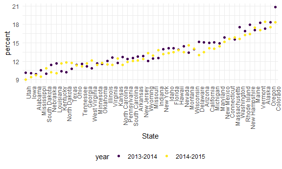

strings_and_factors
================
Jiayi Shi
2022-10-18

``` r
library(rvest)
```

    ## 
    ## Attaching package: 'rvest'

    ## The following object is masked from 'package:readr':
    ## 
    ##     guess_encoding

``` r
library(p8105.datasets)
```

## Strings

str_detect with filter:

``` r
string_vec = c("my", "name", "is", "jeff")

str_detect(string_vec, "jeff")
```

    ## [1] FALSE FALSE FALSE  TRUE

``` r
str_detect(string_vec,"m")
```

    ## [1]  TRUE  TRUE FALSE FALSE

str_replace with mutate:

``` r
str_replace(string_vec, "jeff", "Jeff")
```

    ## [1] "my"   "name" "is"   "Jeff"

^beigin_with

``` r
string_vec = c(
  "i think we all rule for participating",
  "i think i have been caught",
  "i think this will be quite fun actually",
  "it will be fun, i think"
  )

str_detect(string_vec, "^i think")
```

    ## [1]  TRUE  TRUE  TRUE FALSE

end_with\$

``` r
str_detect(string_vec, "i think$")
```

    ## [1] FALSE FALSE FALSE  TRUE

Designate a list of characters that will count as a match.

``` r
string_vec = c(
  "Y'all remember Pres. HW Bush?",
  "I saw a green bush",
  "BBQ and Bushwalking at Molonglo Gorge",
  "BUSH -- LIVE IN CONCERT!!"
  )

str_detect(string_vec,"[Bb]ush")
```

    ## [1]  TRUE  TRUE  TRUE FALSE

Provide a range of letters or numbers that count as a match:

``` r
string_vec = c(
  '7th inning stretch',
  '1st half soon to begin. Texas won the toss.',
  'she is 5 feet 4 inches tall',
  '3AM - cant sleep :('
  )

str_detect(string_vec, "^[0-9][a-zA-Z]")
```

    ## [1]  TRUE  TRUE FALSE  TRUE

The character . matches anything.

``` r
string_vec = c(
  'Its 7:11 in the evening',
  'want to go to 7-11?',
  'my flight is AA711',
  'NetBios: scanning ip 203.167.114.66'
  )

str_detect(string_vec, "7.11")
```

    ## [1]  TRUE  TRUE FALSE  TRUE

search for special character:\\

``` r
string_vec = c(
  'The CI is [2, 5]',
  ':-]',
  ':-[',
  'I found the answer on pages [6-7]'
  )

str_detect(string_vec, "\\[[0-9]")
```

    ## [1]  TRUE FALSE FALSE  TRUE

## Factors

``` r
vec_sex = factor(c("male", "male", "female", "female"))
vec_sex
```

    ## [1] male   male   female female
    ## Levels: female male

``` r
as.numeric(vec_sex)
```

    ## [1] 2 2 1 1

``` r
vec_sex = fct_relevel(vec_sex, "male")#put male first
vec_sex
```

    ## [1] male   male   female female
    ## Levels: male female

``` r
as.numeric(vec_sex)
```

    ## [1] 1 1 2 2

## NSDUH

``` r
nsduh_url = "http://samhda.s3-us-gov-west-1.amazonaws.com/s3fs-public/field-uploads/2k15StateFiles/NSDUHsaeShortTermCHG2015.htm"

table_marj = 
  read_html(nsduh_url) %>% 
  html_table() %>% 
  first() %>%
  slice(-1)#why?
```

``` r
data_marj = 
  table_marj %>%
  select(-contains("P Value")) %>%
  pivot_longer(
    -State,#除了State 这一列
    names_to = "age_year", 
    values_to = "percent") %>% #mutate(percent = as.numeric(percent)) does not work
  mutate(
    percent = str_replace(percent,"[a-b]$",""),
    percent = as.numeric(percent)
  ) %>% 
  separate(age_year, into = c("age", "year"), sep = "\\(") %>% # separate by "(", which is a special character
    mutate(
    year = str_replace(year, "\\)", "")
    ) %>%
  filter(!(State %in% c("Total U.S.", "Northeast", "Midwest", "South", "West","District of Columbia")))
```

Plot:

``` r
data_marj %>%
  filter(age == "12-17") %>% #for 12-17 age group
  mutate(State = fct_reorder(State, percent)) %>% #reorder to plot in a desired sequence
  ggplot(aes(x = State, y = percent, color = year)) + 
    geom_point() + 
    theme(axis.text.x = element_text(angle = 90, hjust = 1))
```



``` r
data("rest_inspec")

rest_inspec %>% 
  slice(1:1000) %>% view #data too large to view
```

``` r
rest_inspec =
  rest_inspec %>%
  filter(grade %in% c("A", "B", "C"), boro != "Missing") %>% 
  mutate(boro = str_to_title(boro))
```

``` r
rest_inspec %>% 
  filter(str_detect(dba, "[Pp][Ii][Zz][Zz][Aa]")) %>% 
  group_by(boro, grade) %>% 
  summarize(n = n()) %>% 
  pivot_wider(names_from = grade, values_from = n)
```

    ## `summarise()` has grouped output by 'boro'. You can override using the
    ## `.groups` argument.

    ## # A tibble: 5 × 4
    ## # Groups:   boro [5]
    ##   boro              A     B     C
    ##   <chr>         <int> <int> <int>
    ## 1 Bronx          1170   305    56
    ## 2 Brooklyn       1948   296    61
    ## 3 Manhattan      1983   420    76
    ## 4 Queens         1647   259    48
    ## 5 Staten Island   323   127    21

``` r
rest_inspec %>% 
  filter(str_detect(dba, "[Pp][Ii][Zz][Zz][Aa]")) %>%
  mutate(
    boro = fct_infreq(boro),#reorder according to the number/frequency of boro
    #boro = str_replace(boro, "Manhattan", "The City")
    #boro = replace(boro, which(boro == "Manhattan"), "The City")
    boro = fct_recode(boro, "The City" = "Manhattan")
    ) %>%
  ggplot(aes(x = boro, fill = grade)) + 
  geom_bar() 
```


